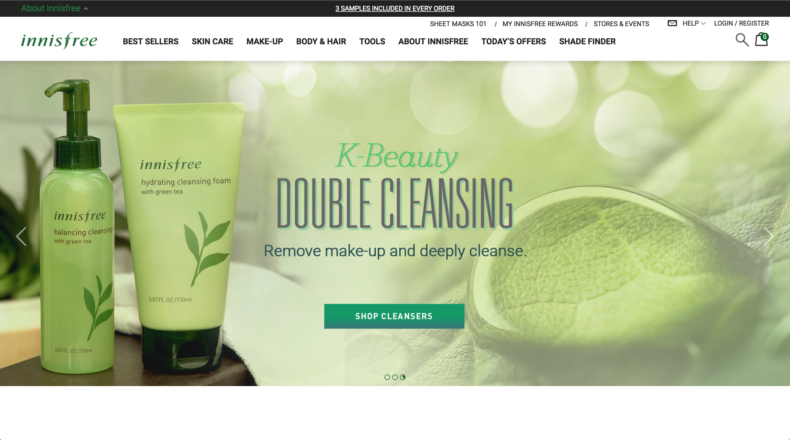
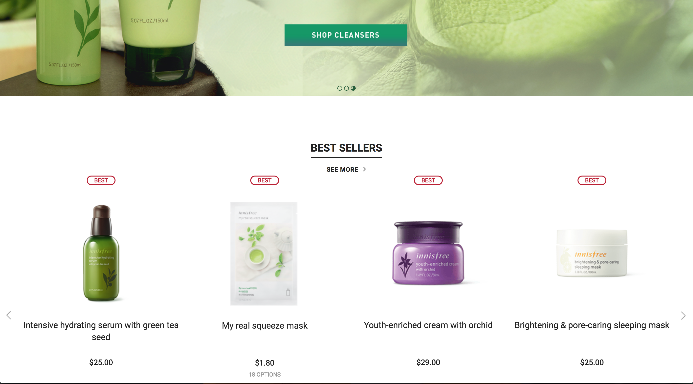
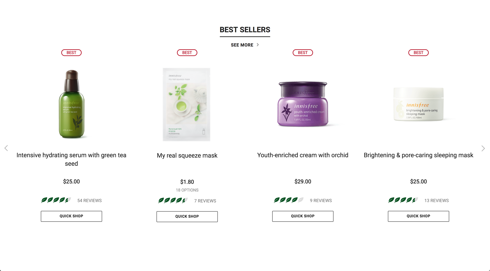
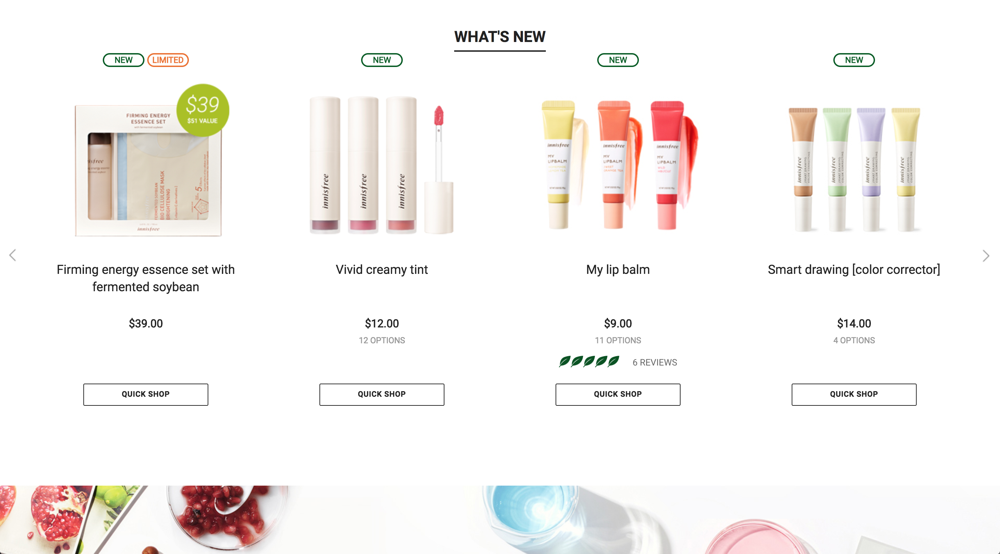
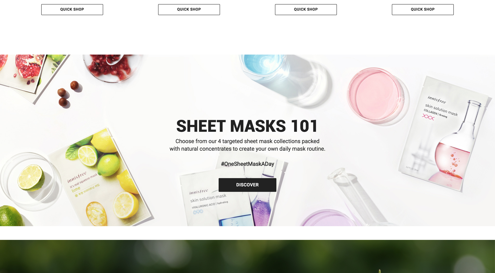
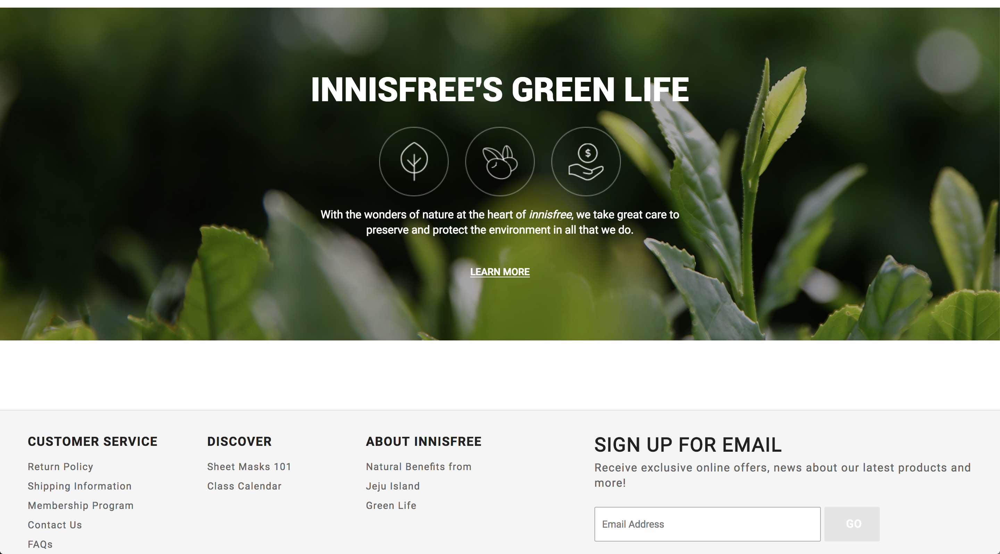
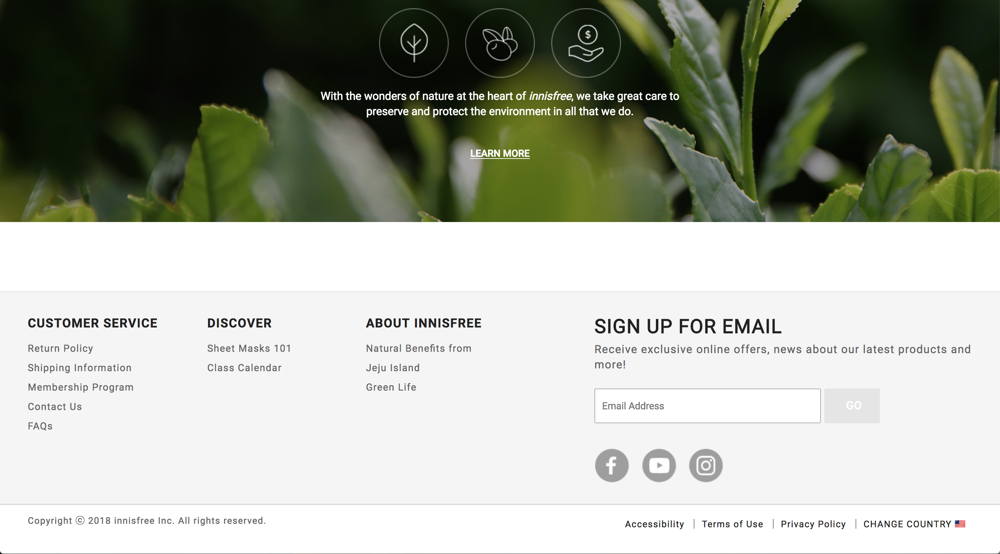

# Organization Clone

#### Clone of Innisfree USA website for independent code review, 9.7.18

#### By Nikki Wong

## Description

This website is a clone of the homepage of the official website for Innisfree USA for CSS/SASS practice.

## Link to Original Website
<a href="https://us.innisfree.com/homepage">Innisfree USA</a>

## Screenshots of Original Website

## Setup

* Clone this repository
* Open a simple HTTP server in the top level of the cloned directory
* Use git functions to add, commit, and push to the master branch in remote repository

## Technologies Used

* HTML
* CSS
* SASS
* Git

## Legal
Copyright (c) 2018 Nikki Wong
